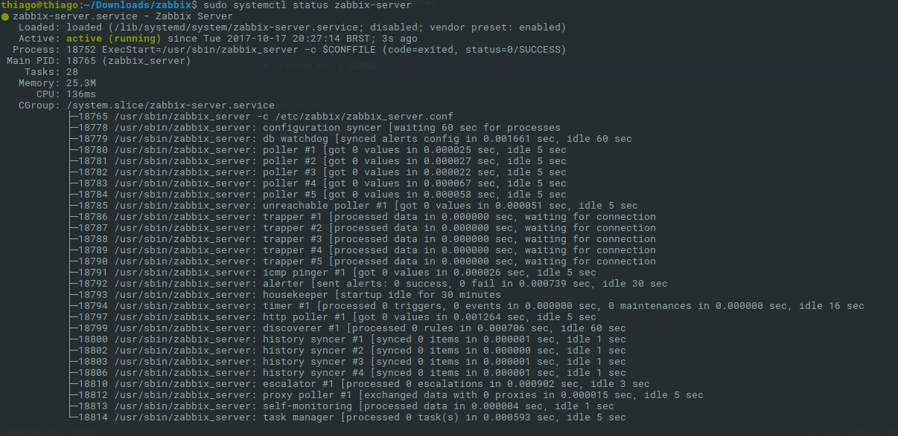

# Zabbix Installer

Este e um script para executar a instalaçao do Zabbix do zero, apenas passando a senha que deseja, e o resto este script faz!



## Como executar

```
  # ./setup.sh -p SENHA
```

## Requisitos

Este script requer alguns pacotes instalados:

- PHP >= 7.0;
- MySQL;

## License

Este script tem licensa MIT, por que <3 open source
